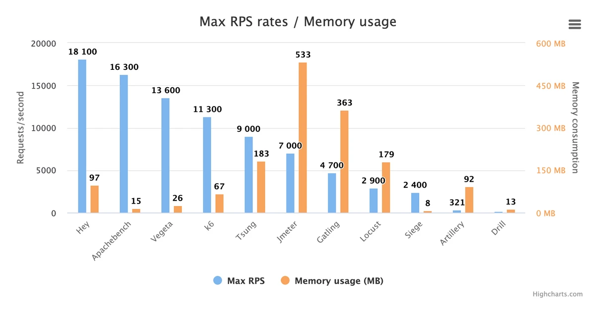
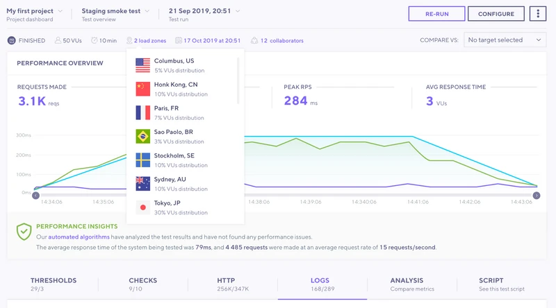

### Szkolenie

Witajcie na szkoleniu z testów wydajnościowych

### Kim jestem ?

Nazywam się Gabriel Starczewski. Swoją karierę zaczynałem jako deweloper PHP. Następnie przez wiele lat bylem managerem zespołów IT w tym SRE, IT Supportu, Monitoringu oraz Architektem Testów (IBM, Credit Suisse, Capgemini).
Obecnie jestem freelancerem i konsultantem w roli Test Architekta/Testera wydajnościowego.

Dewelopuję CRUXa - rozwiązanie do budowy chmury do testów wydajnościowych opartej o Azure i Kubernetes:
https://github.com/ObjectivityLtd/crux. 

Bloguję na
https://www.youtube.com/user/ajaguar2 oraz https://medium.com/@gabriel.starczewski. Jestem założycielem grupy https://www.facebook.com/TestowanieWydajnosciAplikacji

Prowadzę szkolenia z testów wydajnościowych i tematów pokrewnych. Znajdziecie mnie na https://www.linkedin.com/in/gabriel-star-tester/

Moje szkolenia:

- Testy wydajanościowe w JMeter
- Wprowadzenie do testów w k6
- Jak testować skrypty powłoki shell/powershell? 
- CI/CD dla testerów z Jenkinsem
- Docker i Kubernetes dla testerów
- Podstawy aplikacji webowych dla testerów

# Co będzie się działo ?

Na tym szkoleniu poznacie podstawy k6. Agenda:

- Wstęp
- HTTP - przypomnienie najważniejszych informacji
- Rodzaj testów i rodzaje aplikacji testowanych (SPA, MPA, ..)
- JavaScript w 15 minut
- Instalujemy k6
- Pierwszy test
- Batching i grupowanie
- Checki (sprawdzenia)
- Thresholdy (Quality Gate'y)
- Struktura testu
- Użyteczne funkcje: Ciasteczka i ekstraktory
- Zmienne wbudowane i zewnętrzne
- Tagowanie
- Testowanie stron webowych
- Azure i pipeline'y
- Dzielenie testu na moduły
- Wizualizacja wyników z Azure/Grafana/InfluxDB
- Nagrywanie testów i k6 cloud
- Hackathon

# Czym jest k6 ?

[k6](https://k6.io/) to narzędzie typu open source do przerowadzania testów wydajnościowych. W k6 testy piszemy w javascripcie, natomiast samo narzędzie napisane jest w Go co czyni je bardzo wydajnym.
## Wydajność

k6 plasuje się na szczycie [najwydajniejszych narzędzi do testowania wydajności](https://k6.io/blog/comparing-best-open-source-load-testing-tools/#memory-usage-per-vu-level) :).

## Cechy

K6 przenaczone jest dla:

- **Deweloperów i SDET-ów:**
    - proste w użyciu CLI
    - jezykiem opisu testów jest zwykły javascript
- **DevOps i SRE**
    - pozwala na stabilną automatyzację (między innymi w Azure, azure task, docker, system installatiom)
    - posiada natywne wsparcie dla celów SLO i pozwala na ich ewaluację
    - przybliża nas do calkowitej automatyzacji testów wydajnościowych
- **Testerów i QA**
    - testy można tworzyć od zera (ground-up)
    - można konwertować pliki .har, swaggera, kolekcje postmana

## Manifest (https://k6.io/our-beliefs/)

- Proste testy są lepsze niż ich brak
- Testy wydajnościowe powinny być zorientowane na cel
- Deweloperzy powinni pisać testy wydajnościowe
- User-experience jest bardzo ważne:
    - środowiska lokalne
    - wszystko jako kod
    - automatyzacja
- Testuj w środowisku pre-produkcyjnym
  
## Open Source vs Cloud

Narzędzie jest darmowe ale posiada też płatną wersję, w której mamy dostęp do portalu w Chmurze gdzie możemy puszczać testy bez uterzymywania własnej infrastruktury. 

## Gdzie się plasuje w stawce ?

k6 rozwija się bardzo dynamicznie i konkuruje bezpośrednio z takimi narzędziami jak locust czy gatling.

    żródło: https://www.linkedin.com/in/lloyd-watts-5523374/

## Co będziemy potrzebowali ?

- IDE (np. IntelliJ)
- Git
- Windows Terminal
- Azure Subscription - DevOps/Portal

### Zasady i organizacja szkolenia?

- Szkolenie jest typu "hands on". Po każdej paczce teorii, robimy ćwiczenia, jedna osoba z grupy prezentuje rozwiązanie.
- Co mniej więcej 1h robimy 5 minut przerwy.
- O 12:00 40 minut przerwy obiadowej.
- Kamerki są mile widziane kiedy zadajemy pytania albo prezentujemy rozwiązanie.

### Kilka słów o Was na podstawie ankiety

