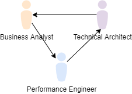

# Analiza wymagań niefunkcjonalnych (NFR/SLO), dobór właściwej strategii testowania, najczęściej spotykane przypadki
***

**NFR** - Non Functional Requirement

**SLO** - Service Level Objective

**SLI** - Service Level Inidcator

## Wymagania niefunkcjonalne
***

Dobrze zdefiniowane:

>**Wymaganie1**: Maksymalna oczekiwana liczba użytkowników na minutę to 180. Akceptowalna liczba błędów to 0.0001 %
>
>**Wymaganie2**: Przy liczbie 180 użytkowników na minutę 95% czasów odpowiedzi API < 4s

Źle zdefiniowane :

>Wymaganie2: Aplikacja ma odpowiadać na każde żądanie < 4s *
>
\* Tak zdefiniowane wymaganie sprawia, że będziemy brali pod uwagę tzw. "outliery" czyli odchyłki. Każdy proces ma pewną zmienność.

## Strategie/podejścia

Często sami określamy co należy przetestować - do tego przydaje się analiza biznesowa. Zadajemy wtedy pytania.

> Co zawsze musi działać w Twojej aplikacji?
>
>
> Jaki problem biznesowy rozwiązuje Twoja aplikacja?
>
> Brak lub niedostępność, której funkcjonalności ma największe konsekwencje?
>

Warto zajrzejć do tego artykułu (SLO/SLI): https://cloud.google.com/blog/products/management-tools/practical-guide-to-setting-slos

Spotkanie 3 stron:

``źródło: Gabriel Starczewski``

Z wywiadu powinniśmy otrzymać listę funkcjonalności do uporządkowania i testowania np:

1. Płatności koszyka
2. Przeszukiwanie najbardziej dochodowych kategorii
3. Wgląd w zamówienie do realizacji
...

## record-correlate-replay (nagraj-skoreluj-odegraj)

1. Używamy prawdziwej aplikacji.
2. Symulujemy użytkownika (przechodząc scenariusz w przeglądarce, z wykorzystaniem Selenium lub np. Cypress)
3. Nagrywamy ruch bezpośrednio lub pośrednio (.har - HTTP Archive Format)
4. Korelujemy żądania w narzędziu.
5. Odgrywamy ruch

(to jest podejście, które będziemy dziś omawiać)

## build-up (zbuduj sam)

Budujemy ruch od zera bez nagrywania na podstawie np. Swagger UI

## goal oriented (zorientowane na cel)

Bazujemy na danych z produkcji. Na przykład wiemy, że konkretna transakcja jest bardzo wolna. Testujemy tylko ją przed poprawkami i po poprawkach.
Podejście selektywne i nastawione na konkretny efekt.

***

## Co potrzebujemy na codzień?

    - Wiedza teoretyczna
    - Kontekst (przedmiot testów, strategia, ...)
    - Narzędzie - rzemiosło
   
Naszym narzędziem będzie JMeter. Wiedzę teoretyczną już macie :)
