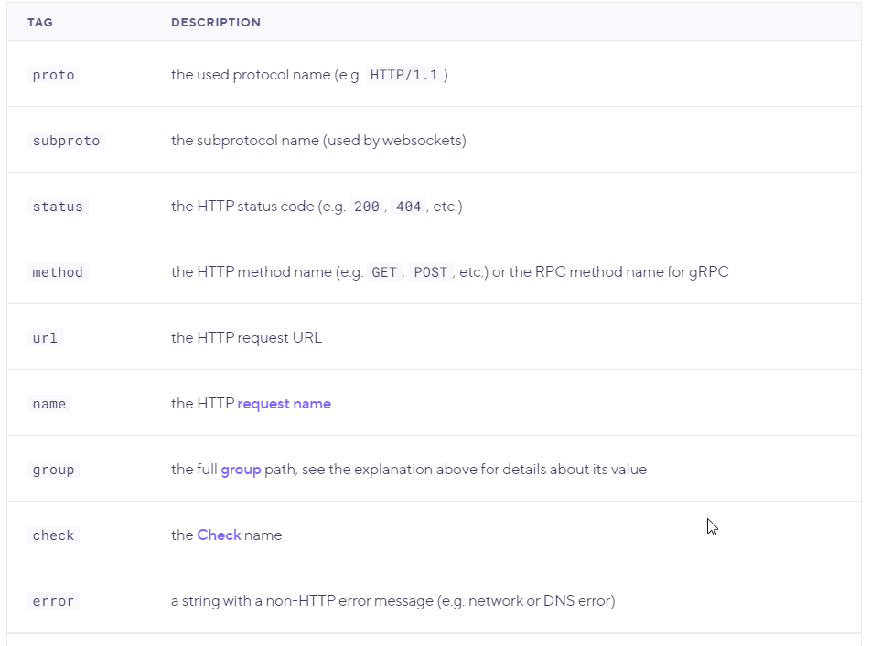

## Tagi

[Tagów](https://k6.io/docs/using-k6/tags-and-groups/), używa się do kategoryzacji elementów k6 w na ogół w celu filtracji później w wynikach lub w innych elementach k6.

Tagi mogę być:
- zdefiniowane przez użytkownika, można tagować:
  - żądania
  - checki
  - metryki użytkownika
  - thresholdy (mogą używać tagów)
- systemowe (mające konkrente znaczenie w k6 np. name - nazwa żądania HTTP)
  - tagi systemowe można nadpisać (najczęściej używamy tego do grupowania wielu żądań z parameterem w jedną grupę)
    
Przykłady tagowania:

```javascript
import http from 'k6/http';
import {check} from 'k6';

export default function () {
    // Add tag to request metric data
    let res = http.get('http://httpbin.org/', {
        tags: {
            type: "html",
        },
    });
    // Add tag to check
    check(
        res,
        {'status is 200': (r) => r.status === 200},
        {
            category: "status check",
            name: 'status is HTTP OK'
        },
    );

}

```

Tagi systemowe


(...)

***
Uruchomimy test i sprawdzimy jak tagi z kodu powyżej prezentują się w wynikach (w pliku csv):

```powershell
k6 run .\02_teoria.js --out csv
```

Następnie przeanalizujemy drugi przykład wyorzystania tagów do agregacji żądań

```powershell
k6 run .\02_tags.js --out csv
```
